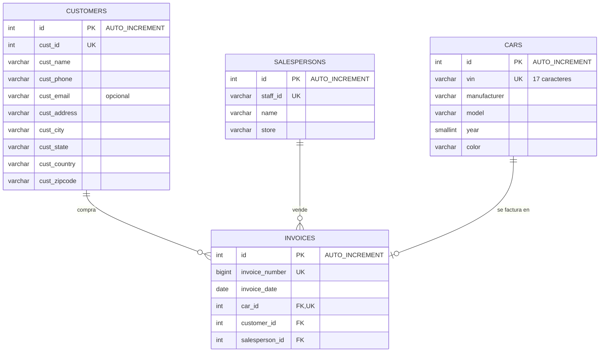

# Diagrama E-R: concesionario de coches (`lab_mysql`)

GitHub dibuja este diagrama automáticamente a partir del bloque `mermaid`.

## Entidades y relaciones

| Relación | Tipo | Por qué |
|---|---|---|
| Cliente → facturas | uno a muchos (1:N) | un cliente puede comprar varios coches; cada factura es de un único cliente |
| Vendedor → facturas | uno a muchos (1:N) | un vendedor hace muchas ventas; cada factura la firma un único vendedor |
| Coche → factura | uno a uno (1:0..1) | un coche concreto (un VIN) solo se vende una vez; puede estar en stock sin factura. Por eso `invoices.car_id` es clave foránea **y** `UNIQUE` |

## Decisiones de diseño

- **Cada tabla tiene su `id` con `AUTO_INCREMENT`**, distinto del identificador de negocio (`cust_id`, `staff_id`, `vin`, `invoice_number`), como pide el enunciado. El `id` es la clave primaria técnica; el de negocio es `UNIQUE` para que no se repita.
- **`invoices` es la tabla central**: guarda las claves foráneas de las otras tres. Así no hace falta repetir los datos del cliente o del coche en cada factura.
- **`staff_id` y los códigos postales son texto (`VARCHAR`)**, no números: `00001` perdería los ceros a la izquierda si fuera `INT`, y hay códigos postales con letras en otros países.
- **`cust_phone` es texto**: lleva espacios y el prefijo `+`.
- **Obligatorios (`NOT NULL`)**: los datos sin los que el registro no tiene sentido (VIN, marca, modelo, nombre del cliente, fecha de factura...). El email del cliente es opcional porque en los datos de ejemplo no está.
